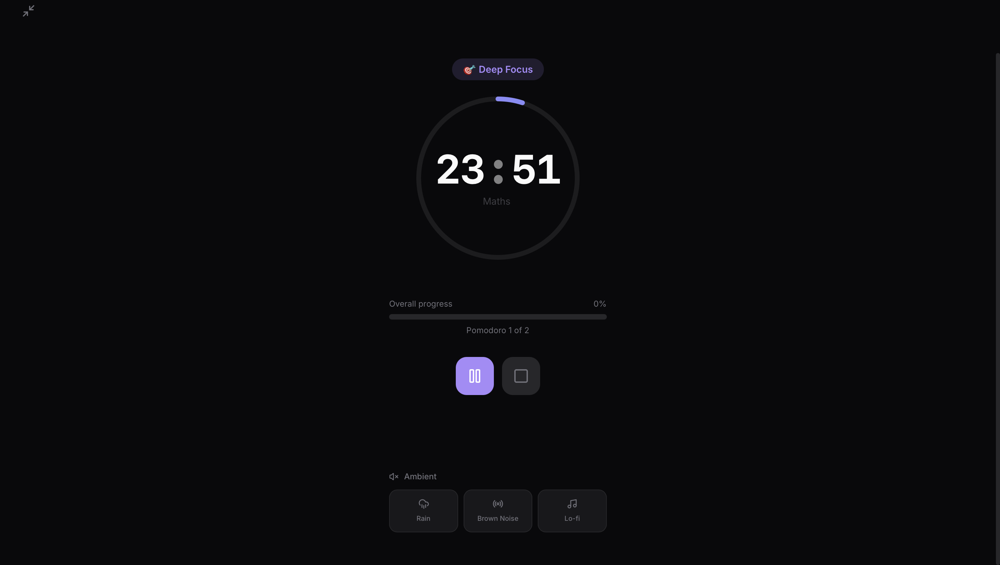

# Focus — Minimalist Study Timer & Pomodoro

Focus is a premium, minimalist study timer application designed to help you maintain deep work through integrated Pomodoro cycles, task management, and immersive ambient soundscapes.



## ✨ Features

- **🎯 Integrated Pomodoro Cycles**: Automatically transitions between focus sessions and breaks.
- **📋 Daily Task Checklist**: Manage your study goals with a sleek, interactive list.
- **🧘 Immersive Focus Mode**: A cinematic, distraction-free interface that activates automatically.
- **🌙 Inactive Minimal Mode**: UI fades out during focus sessions to minimize distractions, leaving only the enlarged timer.
- **🎞️ Premium Animations**: Apple-quality vertical sliding digit transitions for the timer.
- **🕯️ Screen Wake Lock**: Prevents your device from sleeping during active focus sessions.
- **🎵 Ambient Soundscapes**: Procedurally generated Rain, Brown Noise, and Lo-fi textures.
- **📊 Progress Statistics**: Track your daily streaks, focus hours, and weekly performance.
- **🌓 Adaptive Theme**: Stunning dark and light modes with glassmorphic aesthetics.
- **📱 PWA Ready**: Installable on mobile and desktop for a native-like experience.

## 🚀 Tech Stack

- **Framework**: [Next.js 15](https://nextjs.org/) (App Router)
- **Language**: TypeScript
- **Styling**: Tailwind CSS v4
- **State Management**: Zustand (with Persistence)
- **Animations**: Framer Motion
- **Icons**: Lucide React
- **Charts**: Recharts
- **Deployment**: Vercel

## 🛠️ Installation & Setup

### Prerequisites
- Node.js 18.x or later
- npm or yarn

### Local Development

1. **Clone the repository**:
   ```bash
   git clone https://github.com/YOUR_USERNAME/study-timer.git
   cd study-timer
   ```

2. **Install dependencies**:
   ```bash
   npm install
   ```

3. **Run the development server**:
   ```bash
   npm run dev
   ```
   Open [http://localhost:3000](http://localhost:3000) with your browser to see the result.

### Production Build

To create an optimized production build:
```bash
npm run build
```

To preview the production build locally:
```bash
npm run start
```

## 🌐 Deployment

The application is configured for one-click deployment to **Vercel**.

1. Push your code to GitHub.
2. Connect your repository to Vercel.
3. The build settings are automatically detected (Next.js).

Current Live URL: [https://study-timer-pink.vercel.app](https://study-timer-pink.vercel.app)

## 📱 PWA Support

This app includes a `manifest.json` and is PWA-ready. To install:
- **Chrome/Edge**: Click the install icon in the address bar.
- **Safari (iOS)**: Tap "Share" and select "Add to Home Screen".
- **Android**: Tap the menu and select "Install app".

## 📄 License

This project is licensed under the MIT License.
